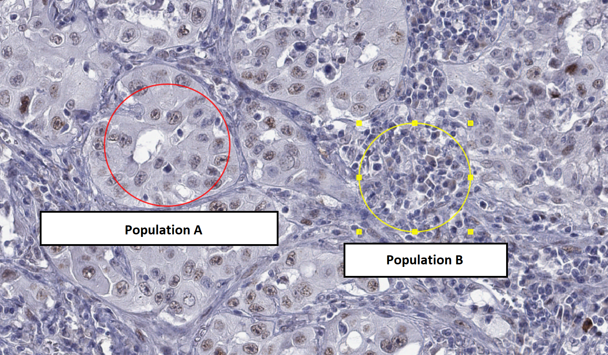

# Download data for lesson

- Download everything from http://195.113.43.46:3388/  , folder lesson 6
  - This includes materials from previous lessons
  - File sources (for access from outside): 
    - Same as previous lesson:
      - QuPath: https://github.com/qupath/qupath/releases/download/v0.5.1/QuPath-v0.5.1-Windows.zip
      - Ki67 Slide 1: https://openslide.cs.cmu.edu/download/openslide-testdata/Hamamatsu/OS-2.ndpi
    - New for this lesson:
      - Lung cancer samples stained for MAGEA4 https://www.ebi.ac.uk/biostudies/files/S-BIAD453/MAGEA4/MAGEA4_(CAB040535)_25000_BOMI2_slide1.svs
- Save to a temporary folder (e.g. on Desktop)

# Unpack and run QuPath

# Train a classifier together

Following https://qupath.readthedocs.io/en/0.5/docs/tutorials/cell_classification.html

- Open OS-2.ndpi
- Detect cells
- Measure -> show measurements maps
  - Nucleus/cell area ratio (filter!)
  - Adjust max!
- Analyze -> Calculate features -> Add smoothed features
- Annotate regions
- Classify -> Object classification -> Train object classifier
  - Live update
- Classify ‣ Object classification ‣ Set cell intensity classifications.

# Final task (for credit)

**Important:** Start with creating a new project. This will let you send the results needed to get credit.

Evaluating the presence of cancer-testis antigens in multiple tissue samples. 

The original study is at https://europepmc.org/article/MED/37341056#mol213474-sec-0007 (for interest only, not needed for the task)

Import file `MAGEA4_(CAB040535)_25000_BOMI2_slide1.svs` into the QuPath project (drag onto the window or File -> Open). 

There are many samples in the same file, we will focus on the top-left cores (the first 4 in the first row).

Run cell detection for a couple areas. The default settings will tend to detect too many cells due to the relatively low resolution of the image. You will want to increase smoothing via "Median filter radius" and "Sigma" options. 
You may also need to change the "Background radius" setting to allow for larger cells.

Once you are happy with the result, store (e.g. screenshot, or just write down) your final cell detection parameters!

Train a classifier to distinguish between the two cell populations shown below - you can use Positive/Negative classes (or add your own in the Annotations card in the left pane and the "..." button below the class list).

Save the classifier.

To get credit at the lesson, show your results to lecturer. Outside of the class, send: your cell detection parameters (screenshot is fine) and the classifier file (found under `your-project-directory\classifiers\object_classifiers`) to martin.modrak@lfmotol.cuni.cz

<!-- 
Note to self: evaluate on 
Slide 1: 
   - Top 4, Left - 2
   - Bottom - 3, LEft-
Slide 2:
  - Left 4, Top - 2
  - Top 1, Right - 4 ( - 3without spaces)
  - Bottom -3, Left - 5 (-3 without spaces)
-->

# Bonus tasks

Detect cell on whole patches and calculate positive/negative-ly stained proportion in each cell-type.

Find other populations to classify in different types of samples.

